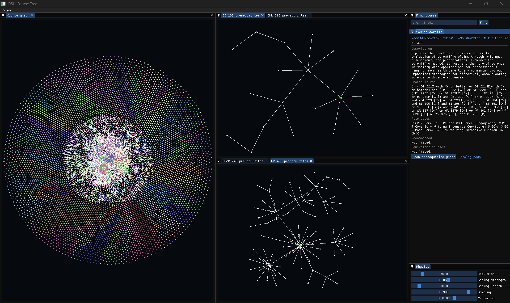

# OSU Course Tree

OSU Course Tree is a visualizer for Oregon State University course prerequisites. It loads the peocessed course catalog data and presents courses as an interactive force-directed graph.

## Highlights

- Browse the complete course catalog by subject-colored clusters.
- Select a course to view its description, prerequisites, attributes, recommendations, and equivalent courses.
- Search by an exact course code, such as `CS 161`.
- Open a focused prerequisite graph for any selected course.
- Pan with the middle or right mouse button and zoom with the scroll wheel.
- Tune the graph simulation with bounded physics controls.

## Requirements

- A C++26 compiler and CMake 4.0 or newer.
- OpenGL 4.6 support.
- SDL3, glad, and glm installed through vcpkg or otherwise discoverable by CMake.

## Data

The application reads `assets/osu_courses_2026_2027_processed.json`. Invalid, missing, or empty catalog data is reported at startup instead of allowing the application to proceed in a broken state.

The data-processing script that produces the catalog is not included in this repository. Please note that the processed data may be missing some data points if it was missed by my parser. If you find any data that is missing please create a issue.
