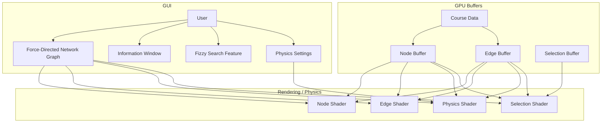

# Oregon State University Course Tree
An interactive graph of all OSU courses that lets you visually the connections between each.

## System Plan

# Notes
The code to generate the JSON course data is not a part of this repository and is kept private.